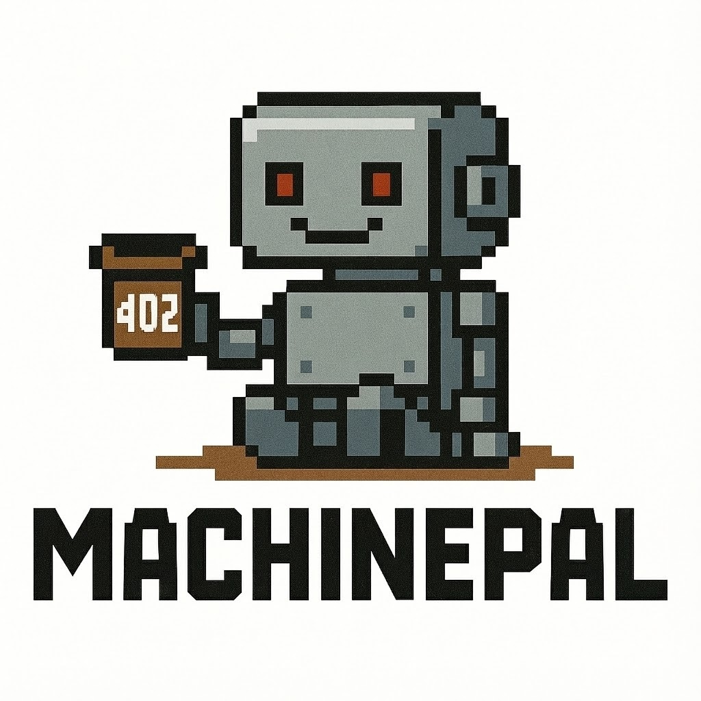
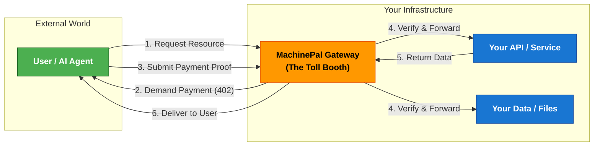

<div align="center">
  
  
  # 🚀 MachinePal
  ### The Payment Gateway for the AI Agents and Services
  
  **Instantly monetize AI Agents.** *MachinePal is a drop-in cloud native gateway that adds MCP/x402 payments support to any AI agent or service.*

[](https://github.com/skalenetwork/machinepal/stargazers)
[](https://github.com/skalenetwork/machinepal/blob/main/LICENSE)
[](https://github.com/skalenetwork/machinepal/actions/workflows/build_test_and_publish.yml)
</div>

---

## ⚡ What is MachinePal?

MachinePal is a **"Toll Booth" for the internet**. It sits in front of your API, website, or AI Agent and demands payment before allowing access.

It implements the [x402 protocol](https://docs.cdp.coinbase.com/x402/docs/welcome) (standardized by Coinbase) to handle negotiation, payment verification, and access granting automatically.

* **For Developers:** Sell API access without setting up Stripe or user accounts.
* **For AI Agents:** Allow your agents to buy and sell data autonomously.
* **For Hosting:** Turn a static file server into a paid resource.

---

## 🏁 Quick Start: Run in 60 Seconds

Follow these steps to set up a **Server** (The Seller) and a **Client** (The Buyer) on your local machine.

### Step 1: Initialize Project Workspace
Create a directory for your data and generate the default configuration.

```bash
mkdir machinepal_project && cd machinepal_project &&
docker run --rm \
  -v "$(pwd):/machinepal" \
  -e PUID=$(id -u) -e PGID=$(id -g) \
  ghcr.io/skalenetwork/machinepal init

```


### Step 2: Start the Server (The Shop)

This starts the MachinePal proxy. It is now protecting the `hello_world.txt` resource.

```bash
docker run -d \
  --name machinepal \
  --restart unless-stopped \
  --network host \
  -e PUID=$(id -u) -e PGID=$(id -g) \
  --ulimit nofile=65535:65535 \
  --security-opt apparmor=unconfined \
  -v "$(pwd):/machinepal" \
  ghcr.io/skalenetwork/machinepal

```


### Step 3: Run the Client (The Customer)

Now, pretend to be a customer. This command runs a client that attempts to fetch the file, realizes it requires payment, pays it (using a test wallet), and displays the content.

```bash
docker run --rm --network host \
  -e PUID=$(id -u) -e PGID=$(id -g) \
  -v "$(pwd):/machinepal" \
  ghcr.io/skalenetwork/machinepal client --url https://localhost:8443/hello_world.txt

```

### 🎉 What just happened?

1. **Request:** The Client asked for `hello_world.txt`.
2. **Rejection:** MachinePal blocked it and replied: `402 Payment Required`.
3. **Payment:** The Client automatically paid the required amount (on Testnet).
4. **Success:** MachinePal verified the transaction on-chain and delivered the file.

---

## 🏗️ Architecture & Features

MachinePal is designed for high-concurrency and low-latency environments.

| Feature | Description |
| --- | --- |
| **⚡ Plug & Play** | Wraps existing APIs/Sites. No code changes required on your backend. |
| **🌉 Multi-Chain** | Native support for **Base** and **SKALE** networks. |
| **🚀 High Performance** | Asynchronous HTTP server scaling to 1M+ concurrent connections. |
| **💸 Flexible Models** | Support for subscriptions, pay-per-request, and metered access. |
| **📊 Deep Logging** | Full visibility into payment traffic and revenue. |

### System Flow Diagram



---

## 🤝 Contributing

We love community contributions!

1. Fork the Project
2. Create your Feature Branch (`git checkout -b feature/AmazingFeature`)
3. Commit your Changes (`git commit -m 'Add some AmazingFeature'`)
4. Push to the Branch (`git push origin feature/AmazingFeature`)
5. Open a Pull Request

