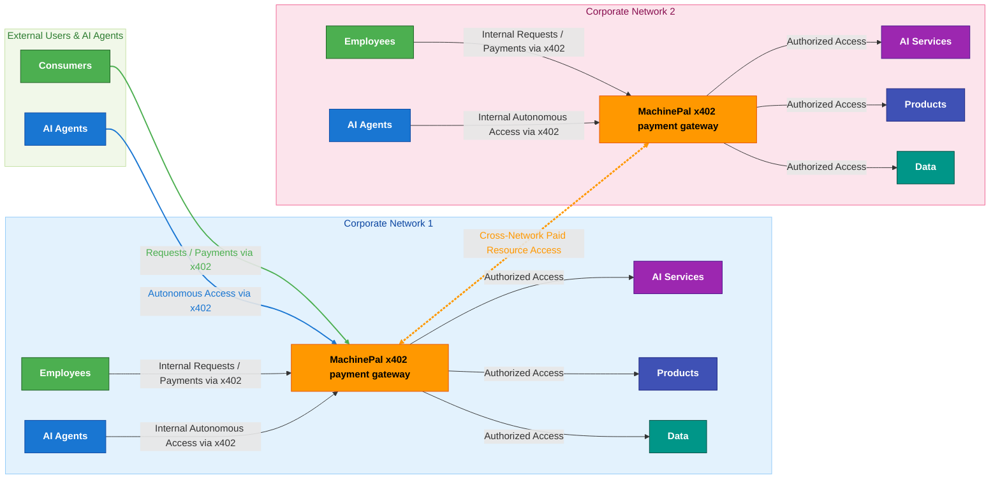

<div align="center">
  
</div>


# RunMachinePal Now

In an empty directory, run:

```bash
docker run --rm -v "$PWD:/machinepay" ghcr.io/skalenetwork/machinepal --init
```

This initializes MachinePal with the default configuration in the current folder.

Then run:

```bash
docker run --network host -v "$PWD:/machinepay" ghcr.io/skalenetwork/machinepal
```

> Note: `--network host` (with a space) is the correct Docker syntax. On Linux it attaches the container to the host network.


# 🚀 MachinePal: The  x402 Payment Agent for the Web

Instantly add **crypto payments** to any website or API using this AI Payment Agent that implements [x402 protocol](https://docs.cdp.coinbase.com/x402/docs/welcome). Sell anything: APIs, resources and products.

[](https://github.com/skalenetwork/machinepal/stargazers)
[](https://github.com/skalenetwork/machinepal/stargazers)
[](https://github.com/skalenetwork/machinepal/network/members)
[](https://github.com/skalenetwork/machinepal/blob/main/CONTRIBUTING.md)
[](https://github.com/skalenetwork/machinepal/issues/new/choose)
[](https://github.com/skalenetwork/machinepal/issues)
[](https://github.com/skalenetwork/machinepal/blob/main/LICENSE)
[](https://github.com/skalenetwork/machinepal/actions/workflows/build_test_and_publish.yml)
[](https://ubuntu.com/)
[](https://www.apple.com/macos/)
[](https://www.microsoft.com/windows/)

---

## ✨ Why use MachinePal? 

- ⚡ **Plug & play** — add x402 payments to existing websites & APIs in minutes
- 🔒 **Fully x402 compliant** — built on the Coinbase standard
- 🛠️ **Easy to deploy & configure** — no complex setup
- 🚀 **Ultra-high performance asynchronous HTTP server** — scales to 1M+ concurrent connections
- 🌉 **Multi-chain support** — works with both **Base** and **SKALE**
- 💸 **Flexible payment models** — subscriptions, pay-per-request, metered access
- 📊 **Deep logging & monitoring** — full visibility of payment traffic
- 💯 **Open source & free** — community-driven

---

## 🏗️ How it Works (The Toll Booth Analogy)

Think of **MachinePal** as a **toll booth for the internet**.  
Instead of reaching a website directly, requests first pass through the proxy:

1. **🔗 You send a request** → try to access a resource
2. **🚦 MachinePal proxy intercepts** → checks if payment is included
3. **💳 Payment verified** → confirmed via the x402 protocol
4. **📡 MachinePal proxy forwards request** → to the real website
5. **🖥️ Website responds** → returns content
6. **📬 MachinePal proxy delivers to you** → completing the paid access loop

✅ Result: Websites instantly monetize access while staying secure and compliant.

---


## MachinePal Architecture diagram





## ⚡ Build Instructions


Install prerequisites:
```bash
    apt-get update && \
    apt-get install -y --no-install-recommends \
        ca-certificates \
        curl \
        git \
        pkg-config \
        unzip \
        zip \
        tar \
        build-essential \
        python3 \
        linux-libc-dev \
        autoconf \
        libtool \
        automake \
        bison \
        flex \
```

```bash
# Clone with dependencies
git clone --recursive https://github.com/skalenetwork/machinepal.git
cd machinepal

# Bootstrap vcpkg
./external/vcpkg/bootstrap-vcpkg.sh
./external/vcpkg/vcpkg install

# Build
cmake -S . -B build \
  -DCMAKE_BUILD_TYPE=Release \
  -DCMAKE_TOOLCHAIN_FILE=external/vcpkg/scripts/buildsystems/vcpkg.cmake \
  -DVCPKG_FEATURE_FLAGS=manifests   -DVCPKG_TARGET_TRIPLET=x64-linux 

cmake --build build -j
```
